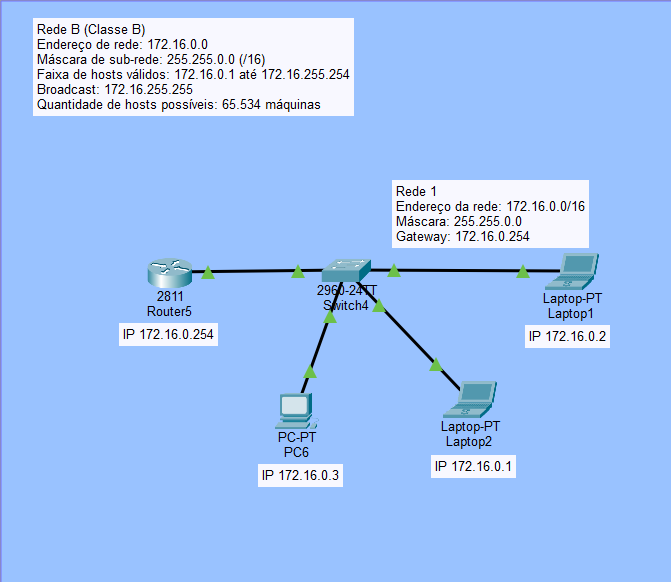
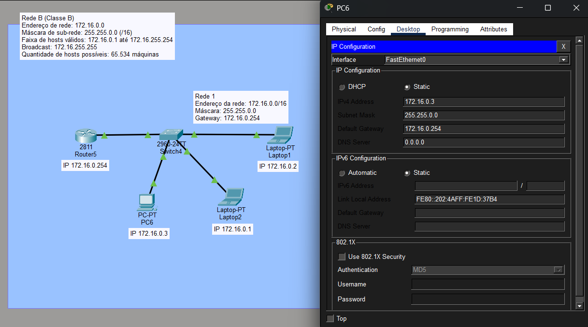

# Classes de Rede IPv4 — A, B e C | Cisco Packet Tracer

## Descrição

Projeto acadêmico desenvolvido para estudar o modelo tradicional de endereçamento IPv4 por classes, abordando as **Classes A, B e C**, suas faixas de endereçamento, máscaras padrão, divisão entre identificação da rede e dos hosts e quantidade de dispositivos suportados.

Além do estudo teórico, foi realizada uma demonstração prática utilizando o **Cisco Packet Tracer**, com configuração de uma rede Classe B, endereçamento IPv4 e testes de conectividade utilizando o comando `ping`.

> **Observação:** as Classes A, B e C pertencem ao modelo histórico de endereçamento IPv4 conhecido como *classful addressing*. Atualmente, o endereçamento IPv4 utiliza principalmente o modelo **CIDR (Classless Inter-Domain Routing)**, baseado em prefixos como `/8`, `/16`, `/24` e outros.

---

## Objetivo

O objetivo da atividade foi compreender os principais conceitos relacionados ao endereçamento IPv4, incluindo:

- estrutura de um endereço IPv4;
- identificação da rede e do host;
- características das Classes A, B e C;
- funcionamento das máscaras de sub-rede;
- quantidade de hosts disponíveis;
- endereço de rede e broadcast;
- configuração manual de endereços IPv4;
- utilização do gateway padrão;
- função de switches e roteadores;
- testes de conectividade utilizando o comando `ping`;
- aplicação prática dos conceitos no Cisco Packet Tracer.

---

## Contexto da atividade

Esta atividade foi realizada **em grupo**, como parte de um estudo sobre fundamentos de redes e endereçamento IPv4.

A entrega oficial do trabalho ocorreu por meio de uma **apresentação em vídeo**, com divisão dos conteúdos entre os integrantes do grupo.

Minha responsabilidade foi estudar e apresentar a **Classe B**, incluindo:

- faixa de endereçamento;
- máscara padrão `/16`;
- divisão entre rede e hosts;
- quantidade de hosts disponíveis;
- configuração dos dispositivos no Cisco Packet Tracer;
- configuração do gateway;
- funcionamento da topologia;
- testes de comunicação utilizando `ping`.

Além disso, produzi um **material de estudo em PDF** reunindo informações sobre as Classes A, B e C.

Esse PDF não foi a entrega oficial do trabalho. Ele foi elaborado por mim como material de apoio para compreender melhor o conteúdo, organizar as informações e auxiliar na preparação e divisão da apresentação do grupo.

---

# Conceitos estudados

## Endereço IPv4

Um endereço IPv4 possui **32 bits**, divididos em quatro grupos de 8 bits chamados de octetos.

Na representação decimal, os quatro octetos são separados por pontos.

Exemplo:

```text
192.168.1.10
```

No modelo tradicional de endereçamento por classes, o primeiro octeto era utilizado para determinar a classe do endereço.

---

## Classe A

No modelo tradicional de endereçamento IPv4:

- **Faixa do primeiro octeto:** 0 a 127
- **Máscara padrão:** `255.0.0.0`
- **Prefixo:** `/8`
- **Rede:** primeiro octeto
- **Hosts:** três últimos octetos
- **Quantidade máxima teórica de hosts válidos:** 16.777.214

Exemplo:

```text
10.52.36.11
```

Em uma rede `/8`, existem 24 bits disponíveis para identificação dos hosts.

O cálculo da quantidade de hosts válidos é:

```text
2^24 - 2 = 16.777.214
```

Os dois endereços descontados correspondem ao endereço da rede e ao endereço de broadcast.

> Dentro da faixa histórica da Classe A existem endereços reservados para finalidades especiais. Por exemplo, o bloco `127.0.0.0/8` é reservado para loopback.

---

## Classe B

No modelo tradicional:

- **Faixa do primeiro octeto:** 128 a 191
- **Máscara padrão:** `255.255.0.0`
- **Prefixo:** `/16`
- **Rede:** dois primeiros octetos
- **Hosts:** dois últimos octetos
- **Quantidade máxima de hosts válidos:** 65.534

Exemplo:

```text
172.16.52.63
```

Em uma rede `/16`, existem 16 bits disponíveis para identificação dos hosts.

O cálculo é:

```text
2^16 - 2 = 65.534
```

---

## Classe C

No modelo tradicional:

- **Faixa do primeiro octeto:** 192 a 223
- **Máscara padrão:** `255.255.255.0`
- **Prefixo:** `/24`
- **Rede:** três primeiros octetos
- **Hosts:** último octeto
- **Quantidade máxima de hosts válidos:** 254

Exemplo:

```text
192.168.1.10
```

Em uma rede `/24`, existem 8 bits disponíveis para identificação dos hosts.

O cálculo é:

```text
2^8 - 2 = 254
```

---

# Comparação entre as Classes A, B e C

| Classe | Primeiro octeto | Máscara padrão | Prefixo | Divisão Rede / Host | Hosts válidos |
|---|---:|---|---:|---|---:|
| A | 0 – 127 | 255.0.0.0 | /8 | 1 octeto / 3 octetos | 16.777.214 |
| B | 128 – 191 | 255.255.0.0 | /16 | 2 octetos / 2 octetos | 65.534 |
| C | 192 – 223 | 255.255.255.0 | /24 | 3 octetos / 1 octeto | 254 |

---

# Demonstração prática — Classe B

Para minha parte da apresentação, foi utilizada como exemplo a rede:

```text
172.16.0.0/16
```

A configuração utilizada foi:

```text
Endereço da rede: 172.16.0.0
Máscara:          255.255.0.0
Prefixo:          /16
Gateway:          172.16.0.254
Broadcast:        172.16.255.255
```

Faixa de hosts válidos:

```text
172.16.0.1 até 172.16.255.254
```

Quantidade máxima de hosts válidos:

```text
65.534
```

No modelo tradicional de endereçamento por classes, um endereço iniciado por `172` está dentro da faixa correspondente à **Classe B**.

Além disso, a rede utilizada faz parte do bloco privado:

```text
172.16.0.0/12
```

Esse espaço é reservado para utilização em redes privadas.

---

## Topologia da rede

A demonstração foi construída no **Cisco Packet Tracer** utilizando:

- 1 roteador;
- 1 switch;
- 3 dispositivos finais;
- endereçamento IPv4 manual;
- máscara de sub-rede `/16`;
- gateway padrão;
- testes de conectividade utilizando `ping`.

A topologia utilizada foi:



Os dispositivos foram configurados da seguinte forma:

| Dispositivo | Endereço IP | Máscara | Gateway |
|---|---|---|---|
| Laptop2 | `172.16.0.1` | `255.255.0.0` | `172.16.0.254` |
| Laptop1 | `172.16.0.2` | `255.255.0.0` | `172.16.0.254` |
| PC6 | `172.16.0.3` | `255.255.0.0` | `172.16.0.254` |
| Roteador | `172.16.0.254` | `255.255.0.0` | — |

---

# Configuração do PC6

O **PC6** foi utilizado para demonstrar a configuração manual de IPv4 e realizar os testes de conectividade.



A configuração utilizada foi:

```text
IP Address:       172.16.0.3
Subnet Mask:      255.255.0.0
Default Gateway:  172.16.0.254
```

A máscara:

```text
255.255.0.0
```

corresponde ao prefixo:

```text
/16
```

Isso significa que os primeiros 16 bits do endereço são utilizados para identificar a rede.

Nesse exemplo:

```text
172.16
```

representa a parte da rede.

Os dois últimos octetos ficam disponíveis para identificação dos hosts.

---

# Testes de conectividade

Após a configuração dos dispositivos, foram realizados testes utilizando o comando `ping`.

## Teste 1 — Comunicação entre dispositivos

A partir do PC6, foi realizado um teste de comunicação com outro dispositivo da mesma rede:

```text
ping 172.16.0.1
```

O resultado apresentado foi:

```text
Packets: Sent = 4, Received = 4, Lost = 0
0% loss
```

Isso confirmou que os dispositivos conseguiam se comunicar corretamente dentro da rede `172.16.0.0/16`.

---

## Teste 2 — Comunicação com o gateway

Também foi realizado um teste entre o PC6 e a interface do roteador configurada como gateway:

```text
ping 172.16.0.254
```

O resultado foi:

```text
Packets: Sent = 4, Received = 4, Lost = 0
0% loss
```

O resultado confirmou a comunicação entre o computador e o roteador.

---

# Papel do Switch e do Roteador

O **switch** é responsável por conectar os dispositivos dentro da mesma rede local.

Como os computadores utilizados no laboratório pertencem à mesma rede:

```text
172.16.0.0/16
```

eles podem se comunicar diretamente através do switch.

O **roteador**, por sua vez, foi configurado como gateway da rede.

Seu papel é encaminhar pacotes quando um dispositivo precisa se comunicar com uma rede diferente.

Portanto, dois computadores que pertencem à mesma sub-rede não precisam utilizar o roteador para se comunicar entre si.

O roteador é necessário quando o tráfego precisa ser encaminhado para outra rede.

---

# Arquivo do Cisco Packet Tracer

O arquivo utilizado na demonstração prática da Classe B está disponível neste repositório.

### [Baixar laboratório Classe B — Cisco Packet Tracer](packet-tracer/classe-b-packet-tracer.pkt)

O laboratório utiliza:

```text
Rede:     172.16.0.0/16
Máscara:  255.255.0.0
Gateway:  172.16.0.254
```

A topologia contém três dispositivos finais conectados a um switch e um roteador configurado como gateway da rede.

Para abrir o arquivo `.pkt`, é necessário utilizar o **Cisco Packet Tracer**.

---

# Material de estudo

Também está disponível neste repositório o PDF que produzi para organizar meus estudos sobre as Classes A, B e C.

### [Material de estudo — Classes de Rede IPv4](docs/material-estudo-classes-ipv4.pdf)

O documento foi produzido como material pessoal de apoio para:

- organizar o conteúdo pesquisado;
- compreender as diferenças entre as classes;
- revisar máscaras e faixas de endereçamento;
- preparar minha parte da apresentação;
- auxiliar na organização do trabalho em grupo.

O PDF não corresponde à entrega oficial da atividade.

---

# Resultado

A prática permitiu relacionar os conceitos teóricos de endereçamento IPv4 com uma configuração realizada no Cisco Packet Tracer.

Foi possível:

- configurar manualmente endereços IPv4;
- configurar máscaras de sub-rede;
- configurar um gateway padrão;
- identificar a rede `172.16.0.0/16`;
- compreender a divisão entre rede e hosts;
- identificar o endereço de broadcast;
- testar a comunicação entre dispositivos;
- testar a comunicação entre um computador e o roteador;
- utilizar o comando `ping` para verificar conectividade.

Os testes apresentaram:

```text
0% de perda de pacotes
```

confirmando que os dispositivos estavam corretamente configurados e conseguiam se comunicar dentro da rede.

---

# Aprendizados

A atividade ajudou a consolidar conhecimentos fundamentais sobre redes de computadores e endereçamento IPv4.

Entre os principais aprendizados estão:

- funcionamento dos endereços IPv4;
- diferença entre endereço de rede e endereço de host;
- função da máscara de sub-rede;
- cálculo da quantidade de hosts disponíveis;
- conceito de endereço de broadcast;
- configuração manual de endereços IP;
- função de switches;
- função de roteadores;
- utilização de gateway padrão;
- utilização do comando `ping`;
- testes básicos de conectividade;
- utilização do Cisco Packet Tracer para simulação de redes.

A atividade também permitiu compreender a diferença entre o modelo histórico de endereçamento por **Classes A, B e C** e o modelo atualmente utilizado, baseado em **CIDR**.

---

# Minha contribuição no trabalho

O trabalho acadêmico foi desenvolvido em grupo, com divisão dos conteúdos entre os participantes.

Minha responsabilidade principal foi a **Classe B**.

Fiquei responsável por estudar e apresentar os seguintes pontos:

- conceito da Classe B;
- faixa do primeiro octeto entre 128 e 191;
- máscara `255.255.0.0`;
- prefixo `/16`;
- divisão entre rede e hosts;
- capacidade de até 65.534 hosts válidos;
- exemplo utilizando a rede `172.16.0.0/16`;
- configuração dos computadores;
- configuração do gateway;
- funcionamento da topologia;
- teste de `ping` entre dispositivos;
- teste de `ping` até o roteador.

Durante a apresentação, demonstrei a configuração da rede no Cisco Packet Tracer e os testes de conectividade realizados a partir do PC6.

Também elaborei o **PDF de estudo sobre as Classes A, B e C** disponibilizado neste repositório para aprofundar minha compreensão do conteúdo e organizar a preparação da apresentação.

---

# Ferramentas e tecnologias utilizadas

- Cisco Packet Tracer
- IPv4
- TCP/IP
- Endereçamento IP
- Máscaras de sub-rede
- CIDR
- Gateway padrão
- Switches
- Roteadores
- Command Prompt
- Comando `ping`

---

# Estrutura do repositório

```text
classes-redes-ipv4-packet-tracer/
│
├── README.md
│
├── imagens/
│   ├── topologia-classe-b-packet-tracer.png
│   └── configuracao-ip-pc6.png
│
├── packet-tracer/
│   └── classe-b-packet-tracer.pkt
│
└── docs/
    └── material-estudo-classes-ipv4.pdf
```

---

# Referências

**CISCO SYSTEMS.** *Configure IP Addresses and Unique Subnets for New Users*. Cisco Support.  
https://www.cisco.com/c/en/us/support/docs/ip/routing-information-protocol-rip/13788-3.html

**CISCO SYSTEMS.** *Cisco Packet Tracer*. Cisco Networking Academy.  
https://www.netacad.com/cisco-packet-tracer

**POSTEL, Jon.** *Internet Protocol*. RFC 791. Internet Engineering Task Force, 1981.  
https://www.rfc-editor.org/rfc/rfc791

**REKHTER, Y.; MOSKOWITZ, B.; KARRENBERG, D.; DE GROOT, G. J.; LEAR, E.** *Address Allocation for Private Internets*. RFC 1918. Internet Engineering Task Force, 1996.  
https://www.rfc-editor.org/rfc/rfc1918

**FULLER, V.; LI, T.** *Classless Inter-domain Routing (CIDR): The Internet Address Assignment and Aggregation Plan*. RFC 4632. Internet Engineering Task Force, 2006.  
https://www.rfc-editor.org/rfc/rfc4632

---

# Observação

Este repositório possui finalidade **educacional e de portfólio**.

A atividade original foi desenvolvida em grupo, enquanto este repositório documenta o conteúdo estudado, a prática realizada no Cisco Packet Tracer, o material de estudo produzido e minha contribuição individual para a apresentação da **Classe B**.
